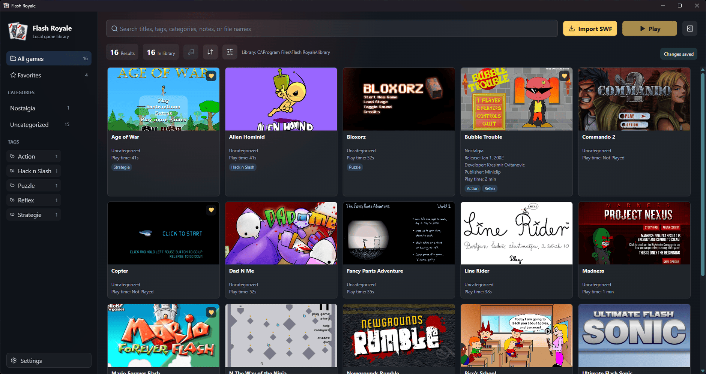

# Flash Royale

> Dominate your flash games library with Flash Royale.



Flash Royale is a library manager for old flash games that lets you have ultimate control. Automatically play the game music, generate cover arts, organise with categories and tags, track your playtime, show/add tons of metadata and more!

> [!WARNING]  
> ### 🛑 Windows 11 Smart App Control Block
> Because this is a **portable .exe** and an open-source project without an expensive commercial signature, **Windows Smart App Control** or **SmartScreen** will block it immediately upon launch. 
> 
> To bypass this restriction, you just need to remove the "Mark of the Web" from the file. Follow these steps before running the app:
>
> 1. Right-click the file "Flash Royale.exe" and select **Properties**.
> 2. At the very bottom of the **General** tab, find the **Security** section.
> 3. Check the box next to **Unblock**.
> 4. Click **Apply**, then click **OK**.
>
> *Alternatively, advanced users can open PowerShell from the app directory and run:*
> ```powershell
> Unblock-File -Path ".\Flash Royale.exe"
> ```

## Features
- Import one or more `.swf` files with the file picker or drag and drop. Duplicate files are detected by SHA-256.
- Copy imported games into the app's library so they remain available if the originals are moved.
- Open the resizable Game Info sidebar to view a game's cover, ratings, metadata, description, private notes, play history, music, and current playback settings.
- Open Game Settings from the info sidebar to edit metadata and ratings, configure playback and online resources, manage music and covers, or delete the game. Edits save automatically, Back returns to Game Info, and selecting a different game starts in the info view.
- Search your library by titles, original filenames, tags, categories, and notes.
- Sort the library and adjust game card size with 8 different sizes.
- Rate games personally in half-star steps. Personal ratings take precedence over source ratings and can be cleared.
- Generate placeholder covers, capture covers from a running game, or choose a PNG, JPG, or WEBP image.
- Play games with Ruffle Web/WASM, fullscreen controls, proportional stage sizing, zoom controls, and optional pinned player controls.
- Set fullscreen and music-repeat behavior per game, plus standalone compatibility and online access.
- Fix scaling / zoom is an opt-in per-game setting. Off lets the SWF use its own scaling, On fits the stage proportionally and keeps it centered.
- Extract likely music tracks from SWF files, choose a built-in track, or select a local custom music file for each game.
- Adjust library music volume. Music fades smoothly and pauses while any game is running, then resumes afterward.
- Track play count, total play time, last-played date, and each game's original SWF stage dimensions.
- Open the separate Explore catalogue window to search Silvergames games, sort by rating or title, paginate results, and see cover art, tags, source ratings, and imported status.
- Open a game's separate info window to inspect its cover, source rating and vote count, age guidance, tags, and description; open the Silvergames page or import the game there. Age guidance is not saved to the library.
- Import games from Explore catalogue window with covers, tags, descriptions, and source ratings saved locally. A separate progress window shows download and import progress.
- Enable or disable Explore catalogue window independently of local library and game playback.
- Configure app startup fullscreen and minimize-to-tray behavior for game launches or ordinary window minimization.
- Change the language in Settings between English, Simplified Chinese, Spanish, French, German, Brazilian Portuguese, Japanese, Korean, Hindi, Arabic, and Russian.
- Create a portable Windows folder that can be compressed and shared.

## Library Music

The library music control plays a game's music separately from its in-game audio. When possible, Flash Royale finds up to six of the SWF's longest embedded audio tracks, which are more likely to be music than sound effects. Every detected track is extracted and saved as an individual MP3 or WAV file in that game's `music/default/` folder, with durations recorded in `tracks.json`. Playback reads the selected file from there. Custom music is copied into `music/custom/` and takes priority over the built-in selection.

Custom music can use MP3, WAV, OGG/OGA, Opus, M4A, AAC, FLAC, or WebM files. The library control has its own volume slider; music fade in and out, repeat according to the per-game setting, and pause while any game player is running. They resume automatically after gameplay. This does not replace or change a game's own audio.

## Player and Scaling

The player keeps the SWF's stage aspect ratio and centers it in the available area. Its toolbar provides fullscreen, zoom in/out, reset zoom, and optional pinned controls.

**Fix scaling / zoom** is off by default, so the SWF controls its own scaling. Turn it on for a game that needs the app to fit its stage to the player window, the stage remains centered.

**Standalone compatibility** uses local-file loading and the original SWF filename, which can expose controls intended for a standalone Flash player. This can fix issues like not being able to log in your account in [The N Game v2](https://www.thewayoftheninja.org/nv2.html).

Each game also has an **Allow online features** toggle and a list of automatically discovered public resources with individual block controls. Online access is enabled by default, disabling it blocks that player's remote requests without disabling local assets. The public-resource relay is separate from login and only handles eligible public GET resources discovered during gameplay.

The public-resource relay accepts up to 50 automatically discovered exact HTTP/HTTPS URLs without credentials, it uses GET only, pins public DNS addresses, rejects redirects and private networks, and limits response size. Numeric `RND` cache-busters are stripped, other query strings and login requests stay outside the relay, and cookies are never forwarded.

## Explore Catalogue and Game Info

Explore is an optional online catalogue. Search the Silvergames catalogue, sort by rating or title, move through result pages, and see game covers, tags, ratings, and which games are already imported.

Each result has a separate game-info window with a larger cover, source rating and vote count, age guidance, tags, and description. From there, open the game's Silvergames page or import it. Imported SWFs and selected catalogue details are stored locally, and a separate progress window tracks the download and importation. Age guidance is shown for reference but is not saved to the library.

The Explore source tabs also include Y8. It contains both SWF and browser-only games that can be sorted by Popularity, Rating, and Date. SWF games import locally, while HTML5/WebGL games can be added as online-only entries and open on Y8 in a sandboxed window.

Y8 game details show available tags, rating and vote count, site play count, likes, description, category, developer, and site-added date. Imports save only tags, rating, vote count, description, category, and developer, alongside the SWF and cover. Y8's 10-point ratings are converted to the library's 5-star scale and Y8's play counts do not become local play counts. Offline compatibility still depends on the individual game.

Andkon is an optional additional catalogue, disabled by default in Settings because many of its games are domain-locked and have low offline compatibility.

### In-app updates on Windows

Settings includes **Check for updates on app start**, enabled by default. Disabling it skips the automatic startup check and the manual **Check for updates** action remains available. This preference does not automatically install updates.

Packaged, extracted Windows portable folders support **Install and restart** when the GitHub release provides a supported ZIP with a SHA-256 digest. The updater downloads from the configured repository, checks the exact size and digest, stages the runtime, and checks write access before closing the app.

The optional **Unblock the verified update files** checkbox is off by default. Selecting it explicitly authorizes removal of Mark of the Web from the staged runtime files before installation, including the executable and DLLs. This does not disable Windows security settings, bypass Smart App Control, or replace code signing.

Close games and Explore and finish imports before updating. The updater replaces only known Electron runtime entries, it does not replace `library` or copy a library bundled in the release. It backs up replaced entries and attempts to restore them if replacement or launching fails. A helper error is shown separately, with an `error.txt` log in the temporary `flash-royale-update-*` folder, retaining that folder if manual recovery is needed. Successful updates restart the app and remove their temporary staging and backup folder.

Release ZIPs should contain exactly one `Flash Royale.exe` alongside `resources/app.asar`, `locales`, and the Electron runtime files. Supported asset names are `Flash-Royale-v<version>-Windows.zip`, `Flash-Royale-<version>-Windows.zip`, `Flash Royale-ReadyToRun.zip`, and `flash-royale.zip`; release tags may have or omit the `v` prefix. Publish through GitHub Releases so the asset metadata includes its SHA-256 digest. Digest verification checks download integrity against GitHub metadata, it is not an independent publisher signature.

## Future Improvements

- Add support for major linux distributions (Need more investigation).
- Add support for HTML game packages in local (Need more investigation).
- Add support for changing the library directory.
- Add bulk editing for tags, categories and game deletion.
- Add option to enable CRT Shaders for each games, and a toggle button in the game player second top menu (Need more investigation).
- Add controller config and mapping settings that can be set independantly for each games and up to 4 different controllers.

## Tech Stack

- Electron
- Vite
- React
- TypeScript
- Fuse.js
- Ruffle
- electron-builder

## Build

```powershell
npm.cmd run build
```

## Packaging

Build the unpacked Electron application and a release ZIP:

```powershell
npm.cmd run package:win
```

This produces `release/win-unpacked/` and `release/Flash-Royale-v<version>-Windows.zip`, using the version in `package.json` (for example, `Flash-Royale-v0.9.6-Windows.zip`). Upload that ZIP to GitHub Releases. It contains the runtime, not your local game library. `npm run package:win` works identically when PowerShell permits the npm launcher.

Packaging does not unblock files or remove their Mark of the Web. ZIPs do not store per-file `Zone.Identifier` streams; normal Windows browser downloads mark the archive, and Windows Explorer normally propagates that mark on extraction. A locally built ZIP is not artificially marked as downloaded. Automatic updating still only unblocks staged runtime files when the user explicitly selects that option.

Create a quick launcher in the project root and `release/Flash Royale-ReadyToRun.zip`:

```powershell
npm.cmd run package:fast
```

Create `flash-royale.zip` in the parent directory of the project, ready to share:

```powershell
npm.cmd run package:share
```

Share the complete archive or folder. Do not send `Flash Royale.exe` by itself.

## Local Data

By default, the library is stored next to the application:

```text
library/
  games/
    <Game Title> [game_id]/
      <Game Title>.swf
      cover/             # This game's cover image
      settings.json      # This game's playback and compatibility settings
      saves/             # This game's Ruffle/browser save storage
      music/default/      # Extracted SWF tracks and tracks.json manifest
      music/custom/       # Optional custom music file
  db.json      # Game metadata
  config.json  # Local configuration
  window-state.json # Saved window positions and sizes
```

Game folder and SWF names use a filesystem-safe version of the title plus the stable game ID, so duplicate titles remain distinct. When existing games need migration, a startup progress window reports the work. Renaming a game in its details panel updates its folder and SWF the next time the app starts. Legacy Ruffle localStorage is copied into the per-game save folders, and the original browser profile is left untouched.

`library/` contains personal data and game files and should not be committed to GitHub.

## Project Structure

```text
electron/             Electron main process and preload
src/                  React frontend
scripts/              Ruffle and packaging scripts
public/               Static asset entry point
docs/                 Development documentation
```

## Documentation

See [docs/DEVELOPMENT.md](docs/DEVELOPMENT.md) for development and maintenance notes.

## Compatibility

Flash playback depends on Ruffle. Some complex AS3 games, SWF files that rely on external assets, and games that Ruffle does not fully support may not run correctly.

## Copyright and Content Notice

This repository contains only the Flash Royale source code. Do not commit third-party SWF games, cover images, or personal libraries unless you have the right to share them.
